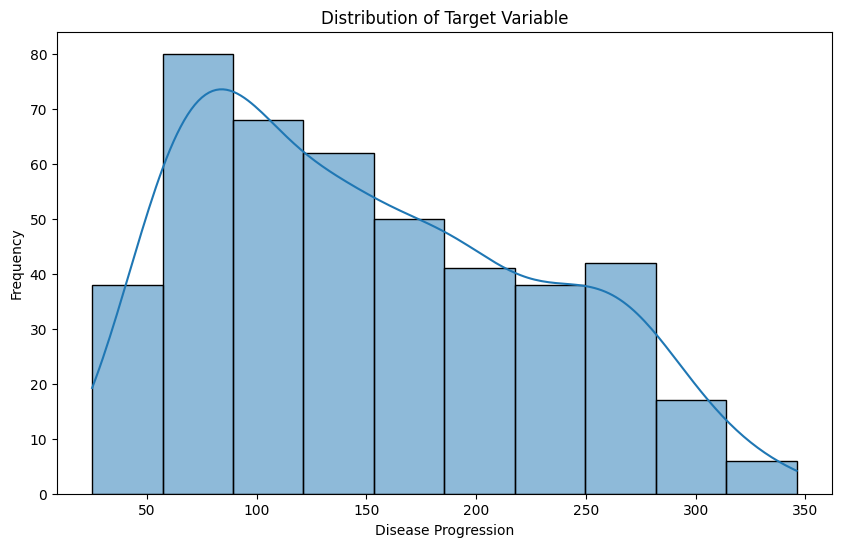

# Data-Driven Insights into Diabetes Progression

**Jupyter Notebook with code, experimentation, further insights, and deployment strategies: [here](https://github.com/vivianamarquez/Regression-Sklearn-Diabetes-Dataset/blob/main/Regression_Example.ipynb).**

**Website for this repo: [here](https://vivianamarquez.com/Regression-Sklearn-Diabetes-Dataset/).**

## Business Goal

Diabetes is a chronic condition that affects millions of people worldwide. Managing and predicting diabetes progression can significantly improve patient outcomes and healthcare efficiency. The goal of this analysis is to develop predictive models that can forecast disease progression based on various medical and demographic features. This can help in identifying high-risk patients early and tailoring personalized treatment plans.

## Data

The diabetes dataset from `sklearn` contains ten baseline variables, all of which are numeric. The column **`target`** contains the target variable, which represents the measure of disease progression after one year. More info on this dataset: [https://scikit-learn.org/stable/modules/generated/sklearn.datasets.load_diabetes.html#sklearn.datasets.load_diabetes](https://scikit-learn.org/stable/modules/generated/sklearn.datasets.load_diabetes.html#sklearn.datasets.load_diabetes)

## Modeling and performance

In this project, we employed various regression modeling techniques to predict diabetes progression using the diabetes dataset from `sklearn`. The models evaluated include `Linear Regression`, `Ridge Regression`, `Lasso Regression`, and `Elastic Net Regression`. Each model was trained and evaluated using a train/test split, followed by cross-validation and hyperparameter tuning using GridSearchCV to optimize performance. 

Among these, the Lasso Regression model demonstrated the best performance with a `Root Mean Squared Error (RMSE) of 52.8980` and an` R-squared (R²) value of 0.4719`. That means that the model's prefictions are off by about 52..90 units from the actual values of diabetes progression andapproximately 47.19% of the variance in the disease progression is explained by the features in the model. 

<iframe src="https://vivianamarquez.com/Regression-Sklearn-Diabetes-Dataset/images/actual_vs_predicted.html" width="100%" height="600px"></iframe>

To see the interactive plot of actual vs. predicted values, please click the link below:
[Actual vs. Predicted Values](https://vivianamarquez.com/Regression-Sklearn-Diabetes-Dataset/images/actual_vs_predicted.html)

These metrics indicate that the Lasso Regression model provides a moderate level of accuracy in predicting diabetes progression, making it the most suitable model for this dataset. The model's ability to perform feature selection through L1 regularization helped in identifying the most significant predictors, thus enhancing interpretability and relevance.

(Note: This notebook is for teaching purposes, so ensemble models were not included.)

## Conclusions

The model revealed that there’s a significant relationship between certain features and the target variable (diabetes progression). Specifically, BMI, serum triglycerides, and blood pressure are positively associated with increased disease progression, while HDL cholesterol and T-Cells are negatively associated. These findings provide actionable insights for managing diabetes more effectively.

#### Interesting Findings

| Feature                                 | Recommendation                                                                                     | Coefficient Value | Impact               | Interpretation                                                                                  |
|-----------------------------------------|--------------------------------------------------------------------------------------------------|-------------------|----------------------|-------------------------------------------------------------------------------------------------|
| Body Mass Index (BMI)                   | Implement and encourage weight management programs to reduce BMI.                                | 552.697775        | Strong positive      | Higher BMI is strongly associated with increased diabetes progression.                          |
| Serum Triglycerides (s5)                | Advocate for dietary changes that lower triglyceride levels, such as reducing sugar intake.       | 447.919525        | Strong positive      | Higher serum triglycerides levels are associated with increased diabetes progression.            |
| Blood Pressure (BP)                     | Encourage regular blood pressure monitoring and provide resources for managing high blood pressure. | 303.365158        | Significant positive | Higher blood pressure is associated with increased diabetes progression.                        |
| High-Density Lipoproteins (HDL) Cholesterol (s3) | Encourage diets rich in healthy fats to increase HDL levels.                                      | -229.255776       | Strong negative      | Higher HDL cholesterol levels are associated with decreased diabetes progression.                |
| Sex                                     | Develop personalized treatment plans that consider the patient’s sex.                            | -152.664779       | Significant negative | Differential impact based on sex, with higher values (likely males) associated with lower progression. |
| T-Cells (s1)                            | Focus on treatments and interventions that may boost T-Cells levels if applicable.                | -81.365007        | Moderate negative    | Higher levels of T-Cells are associated with decreased diabetes progression.                    |
| Blood Sugar Level (s6)                  | Provide education on managing blood sugar levels and ensure regular monitoring.                   | 29.642617         | Positive             | Higher blood sugar levels are associated with increased diabetes progression.                    |
| Age                                     | No specific recommendation needed based on this feature.                                          | 0.000000          | None                 | Age does not contribute to predicting diabetes progression.                                      |
| Low-Density Lipoproteins (LDL) Cholesterol (s2) | No specific recommendation needed based on this feature.                                          | 0.000000          | None                 | LDL cholesterol does not contribute to predicting diabetes progression.                          |
| Total Cholesterol/HDL Ratio (s4)        | No specific recommendation needed based on this feature.                                          | 0.000000          | None                 | The total cholesterol/HDL ratio does not contribute to predicting diabetes progression.          |

### Actionable insights

- **Weight Management Programs:** Develop and promote programs focused on weight management, such as nutrition counseling, exercise regimes, and support groups to help reduce BMI.

- **Blood Pressure Monitoring**: Encourage regular blood pressure check-ups and provide resources for managing high blood pressure through lifestyle changes and medication.

- **Personalized Care:** Develop personalized treatment plans that consider the patient’s sex to optimize care and manage diabetes progression more effectively.

- **Diet and Lifestyle Adjustments:** Encourage diets rich in healthy fats, such as those found in fish, nuts, and olive oil, to increase HDL cholesterol levels. Advocate for dietary changes that lower triglyceride levels, such as reducing sugar and refined carbohydrates intake.

- **Blood Sugar Control, Education and Tools:** Provide patients with education on managing blood sugar levels, including the use of glucometers and adherence to medication.
 
